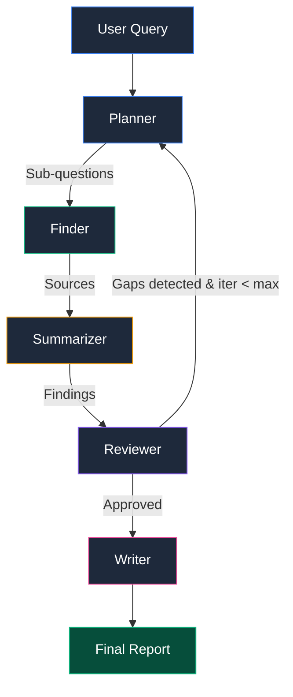

# Deep Research System

A production-grade local deep research application using multi-agent orchestration with LangGraph and Ollama. Features a real-time Mission Control dashboard for monitoring AI agents as they research any topic.


## 🎥 Demo

The system features a **Mission Control Dashboard** where you can:
- Enter any research query
- Watch 5 AI agents work in real-time
- See live event streaming via SSE
- Monitor progress with visual indicators
- Stop research at any time
- Download final reports as Markdown

**Access:** http://localhost:5173

## Architecture

```
┌─────────────────────────────────────────────────────────────────────────┐
│                         MISSION CONTROL DASHBOARD                       │
│                     (React + Vite + Tailwind + Framer Motion)           │
│                                                                         │
│   ┌──────────────┐  ┌──────────────┐  ┌──────────────┐                 │
│   │Research Input│  │Agent Pipeline│  │ Event Log    │                 │
│   │  (Zustand)   │  │ (5 Agents)   │  │   (SSE)      │                 │
│   └──────────────┘  └──────────────┘  └──────────────┘                 │
│          │                   │                   │                      │
│          └───────────────────┼───────────────────┘                      │
│                              │                                          │
│                    ┌─────────┴─────────┐                                │
│                    │  Report Viewer    │                                │
│                    │ (Markdown + DL)   │                                │
│                    └───────────────────┘                                │
└─────────────────────────────────────────────────────────────────────────┘
                                    │
                                    │ HTTP / SSE
                                    ▼
┌─────────────────────────────────────────────────────────────────────────┐
│                         BACKEND API (FastAPI)                           │
│                                                                         │
│  ┌─────────────┐  ┌─────────────┐  ┌─────────────┐  ┌─────────────┐   │
│  │   Planner   │──▶│   Finder    │──▶│ Summarizer  │──▶│  Reviewer   │   │
│  │ (Decompose) │  │  (Search)   │  │ (Compress)  │  │ (Check)     │   │
│  └─────────────┘  └─────────────┘  └─────────────┘  └──────┬──────┘   │
│                                                            │          │
│                              ┌─────────────────────────────┘          │
│                              │ (conditional: gaps & iter<max)         │
│                              ▼                                         │
│                       ┌─────────────┐  ┌─────────────┐                │
│                       │   Writer    │──▶│   Report    │                │
│                       │ (Synthesize)│  │  (Output)   │                │
│                       └─────────────┘  └─────────────┘                │
└─────────────────────────────────────────────────────────────────────────┘
                                    │
                                    │ SQLite (Checkpointer)
                                    ▼
┌─────────────────────────────────────────────────────────────────────────┐
│                      INFERENCE ENGINE (Ollama)                          │
│                                                                         │
│                    gpt-oss:20b with ROCm Support                       │
│                      (Auto-download on first start)                     │
└─────────────────────────────────────────────────────────────────────────┘
```

### LangGraph Workflow



### The 5 Agents

| Agent | Role | Description | Color |
|-------|------|-------------|-------|
| **Planner** | Query Decomposition | Breaks complex queries into 6-8 sub-questions | 🔵 Blue |
| **Finder** | Source Discovery | Discovers diverse sources via DuckDuckGo (max 2/domain) | 🟢 Green |
| **Summarizer** | Content Compression | 10:1 compression with key facts extraction | 🟡 Amber |
| **Reviewer** | Quality Control | Detects gaps, triggers iteration loops | 🟣 Violet |
| **Writer** | Report Synthesis | Professional report with citations | 🩷 Pink |

**Iteration Loop:** If the Reviewer detects gaps and max iterations not reached, it loops back to the Planner for deeper research.

---

## 🚀 Development Stages

| Phase | Status | Description |
|-------|--------|-------------|
| **Phase 0** | ✅ Complete | Infrastructure: Docker, GPU support (Strix Halo), auto-download |
| **Phase 1** | ✅ Complete | Backend Core: FastAPI, config, Ollama adapter, SQLite checkpointer |
| **Phase 2** | ✅ Complete | Planner Agent: Query decomposition + LangGraph setup |
| **Phase 3** | ✅ Complete | All 5 Agents + Full Graph Assembly with conditional routing |
| **Phase 4** | ✅ Complete | Streaming & Interruption: SSE endpoints, stop/resume |
| **Phase 5** | ✅ Complete | Frontend Dashboard: Mission Control UI with real-time updates |
| **Phase 6** | ✅ Complete | **Integration & Polish: Report viewer, sessions, error boundaries** |

---

## Quick Start

### Prerequisites

- Docker & Docker Compose
- AMD GPU with ROCm drivers (for GPU acceleration)
- **For Strix Halo (Ryzen AI Max):** Ubuntu 25.04+ with kernel 6.12+
- Ports: 11434 (Ollama), 8000 (Backend), 5173 (Frontend)

### 🔧 GPU Configuration (Strix Halo / RDNA 3.5)

```bash
# Find your GPU group IDs
getent group video | cut -d: -f3   # e.g., 44
getent group render | cut -d: -f3  # e.g., 991

# Copy and edit environment
cp .env.example .env
# Edit VIDEO_GID and RENDER_GID to match your system
```

The `.env` file should contain:
```env
VIDEO_GID=44
RENDER_GID=991
HSA_OVERRIDE_GFX_VERSION=11.5.1
```

### ⚠️ Important: Stop Local Ollama First!

```bash
# Stop local Ollama service
sudo systemctl stop ollama
# or
pkill ollama

# Verify port is free
sudo lsof -i :11434  # Should return nothing
```

### Start the System

```bash
# Clone and setup
git clone <repo>
cd open-research

# Copy environment template
cp .env.example .env

# Start all services (Ollama auto-downloads model on first start)
docker compose up --build -d

# Monitor Ollama model download
docker logs -f deepresearch-ollama

# Check all services
curl http://localhost:8000/health
curl http://localhost:5173
```

### Access the Dashboard

| Service | URL | Description |
|---------|-----|-------------|
| **🎛️ Mission Control** | http://localhost:5173 | **Main Dashboard** - Start researching here! |
| **API Docs (Custom)** | http://localhost:8000/custom-docs | Bootstrap-styled documentation |
| **API Docs (Swagger)** | http://localhost:8000/docs | Interactive OpenAPI docs |
| **Backend API** | http://localhost:8000 | FastAPI endpoints |
| **Ollama** | http://localhost:11434 | Inference API |

### Stop Everything

```bash
docker compose down

# To also remove data volumes:
docker compose down -v
```

---

## 🎛️ Using the Mission Control Dashboard

### 1. Start a Research

1. Open http://localhost:5173
2. Enter your research query (e.g., "Latest AI developments in healthcare 2024")
3. Click **"Start Research"** or press **Ctrl+Enter**
4. Watch the agents work in real-time!

### 2. Monitor Progress

- **Agent Pipeline** (left): See which agent is currently active
- **Sessions** (left): View all research sessions with status
- **Progress Bar** (top): Overall completion percentage
- **Event Log** (right): Real-time SSE events from the backend
- **Stop Button** (top-right): Cancel running research

### 3. View Results

When research completes:
- **Report Viewer** displays the final report with:
  - Executive Summary
  - Detailed sections
  - Source citations with reliability ratings
  - Confidence assessment
- **Download** button saves as Markdown

### 4. Agent States

| State | Indicator | Meaning |
|-------|-----------|---------|
| Idle | Gray | Agent waiting to start |
| Running | Blue pulse | Agent actively working |
| Completed | Green check | Agent finished successfully |

### 5. Keyboard Shortcuts

| Shortcut | Action |
|----------|--------|
| `Ctrl + Enter` | Start research |

---

## 🧪 API Testing

### Health & Status

```bash
# Health Check
curl http://localhost:8000/health

# API Status
curl http://localhost:8000/api/status
# Response: {"status":"operational","features":{"planner":"implemented",...}}
```

### Individual Agent Tests

```bash
# Test Planner Agent
curl -X POST http://localhost:8000/api/test/planner
# Response: 6 sub-questions generated

# Test Source Finder Agent
curl -X POST http://localhost:8000/api/test/finder
# Response: 10 diverse sources discovered

# Test Summarizer Agent
curl -X POST http://localhost:8000/api/test/summarizer
# Response: 5 key facts, 0.95 relevance

# Test Reviewer Agent
curl -X POST http://localhost:8000/api/test/reviewer
# Response: 3 gaps detected, 0.88 confidence

# Test Writer Agent
curl -X POST http://localhost:8000/api/test/writer
# Response: 1200-word report, 6 sections

# Test Full Graph (all 5 agents)
curl -X POST http://localhost:8000/api/test/graph
# Response: Full pipeline result (takes 5-10 min)
```

### Streaming & Interruption

```bash
# Start Research
curl -X POST http://localhost:8000/api/research/start \
  -H "Content-Type: application/json" \
  -d '{"query": "AI in healthcare 2024"}'
# Response: {"status":"started","session_id":"research-abc123",...}

# Stream Events (SSE)
curl http://localhost:8000/api/research/research-abc123/events
# Stream: connected → research_started → heartbeat → ... → completed

# Stop Research
curl -X POST http://localhost:8000/api/research/research-abc123/stop

# Check Status
curl http://localhost:8000/api/research/research-abc123/status

# List All Sessions
curl http://localhost:8000/api/research/sessions
```

---

## 📁 Project Structure

```
open-research/
├── docker-compose.yml          # Service orchestration
├── .env                        # Environment configuration
├── .env.example                # Configuration template
├── start.sh                    # Automation script
│
├── ollama/                     # Ollama service (auto-download)
│   ├── Dockerfile
│   └── entrypoint.sh
│
├── backend/                    # FastAPI Backend (Phases 1-4)
│   ├── app/
│   │   ├── api/
│   │   │   └── routes.py       # HTTP endpoints + SSE
│   │   ├── core/
│   │   │   ├── config.py       # Pydantic Settings
│   │   │   ├── ollama_adapter.py   # VLLM singleton
│   │   │   ├── checkpointer.py     # SQLite persistence
│   │   │   ├── graph.py            # LangGraph workflow
│   │   │   └── research_manager.py # Session management
│   │   ├── agents/             # 5 LangGraph agents
│   │   │   ├── prompts/        # System prompts (.md)
│   │   │   ├── planner.py      # Query decomposition
│   │   │   ├── finder.py       # Source discovery
│   │   │   ├── summarizer.py   # Content compression
│   │   │   ├── reviewer.py     # Gap detection
│   │   │   └── writer.py       # Report synthesis
│   │   └── models/
│   │       └── state.py        # ResearchState TypedDict
│   ├── docs/
│   │   └── index.html          # Bootstrap documentation
│   ├── main.py                 # FastAPI entry
│   └── pyproject.toml          # Dependencies (uv)
│
├── frontend/                   # React Frontend (Phases 5-6)
│   ├── src/
│   │   ├── components/         # React components
│   │   │   ├── ui/             # Atomic UI components
│   │   │   │   ├── Button.tsx
│   │   │   │   ├── Card.tsx
│   │   │   │   ├── Badge.tsx
│   │   │   │   └── Input.tsx
│   │   │   ├── ResearchInput.tsx
│   │   │   ├── AgentStatus.tsx
│   │   │   ├── ProgressTracker.tsx
│   │   │   ├── TraceLog.tsx
│   │   │   ├── StopButton.tsx
│   │   │   ├── ReportViewer.tsx    # NEW: Report display
│   │   │   ├── SessionList.tsx     # NEW: Session sidebar
│   │   │   └── ErrorBoundary.tsx   # NEW: Error handling
│   │   ├── hooks/              # Custom hooks
│   │   │   ├── useAgentStream.ts   # SSE streaming
│   │   │   └── useResearch.ts      # API operations
│   │   ├── stores/
│   │   │   └── researchStore.ts    # Zustand state
│   │   ├── pages/
│   │   │   └── MissionControl.tsx  # Main dashboard
│   │   ├── types/
│   │   │   └── index.ts            # TypeScript types
│   │   ├── App.tsx
│   │   ├── main.tsx
│   │   └── index.css           # Tailwind + custom styles
│   ├── index.html
│   ├── package.json
│   ├── tsconfig.json
│   └── vite.config.ts
│
└── agent/                      # Project tracking
    ├── PLAN.md                 # Execution roadmap
    ├── MEMORY.md               # Technical decisions
    ├── logs.md
    └── error.md
```

### Frontend Architecture

**Atomic Design Principles:**
- **Atoms:** Button, Card, Badge, Input (pure UI)
- **Molecules:** ResearchInput, StopButton (composed atoms)
- **Organisms:** AgentStatus, ProgressTracker, TraceLog, ReportViewer (complex features)
- **Pages:** MissionControl (full layout)

**State Management:**
- **Zustand:** Global state in `stores/researchStore.ts`
- **Custom Hooks:** Business logic separated from UI
  - `useAgentStream.ts` - SSE connection handling
  - `useResearch.ts` - API calls

**Key Features:**
- **ReportViewer:** Displays final report with Markdown rendering and download
- **SessionList:** Auto-refreshing sidebar showing all sessions
- **ErrorBoundary:** Graceful error recovery with reload option
- **Keyboard Shortcuts:** Ctrl+Enter to start research

---

## Troubleshooting

### Port 11434 Already in Use

```bash
sudo systemctl stop ollama
# or
pkill ollama
```

### ROCm GPU Not Detected

**For Strix Halo (RDNA 3.5 / gfx1151):**
```bash
# Verify GPU detection
docker logs deepresearch-ollama | grep "inference compute"
# Should show: library=ROCm compute=gfx1151

# Check GPU is visible
rocm-smi
```

### Model Auto-Download

```bash
# Monitor download progress
docker logs -f deepresearch-ollama
# Wait for: "✓ Model is ready to use!"
```

### Frontend Not Loading

```bash
# Check frontend logs
docker logs deepresearch-frontend

# Rebuild frontend
docker compose build frontend
docker compose up -d frontend
```

### Backend Errors

```bash
# Check backend logs
docker logs deepresearch-backend

# Test backend directly
curl http://localhost:8000/health
```

---

## Development Status

**🎉 PROJECT COMPLETE - All 6 Phases Delivered!**

### Completed Features
- ✅ **Infrastructure:** Docker, GPU support (Strix Halo), auto-download
- ✅ **Backend Core:** FastAPI, Pydantic config, Ollama adapter, SQLite checkpointer
- ✅ **5 AI Agents:** Planner, Finder, Summarizer, Reviewer, Writer with iteration loops
- ✅ **LangGraph:** Complete pipeline with conditional routing
- ✅ **Streaming:** SSE endpoints for real-time progress updates
- ✅ **Interruption:** Stop/resume functionality with graceful shutdown
- ✅ **Mission Control Dashboard:** React + Vite + Tailwind + Framer Motion
  - Real-time agent visualization with color-coded status
  - Progress tracking with gradient progress bar
  - Event log streaming with icons and timestamps
  - Report viewer with Markdown rendering and download
  - Session list with auto-refresh
  - Error boundaries for graceful recovery
  - Keyboard shortcuts (Ctrl+Enter)
  - Responsive design for all screen sizes

### Architecture Highlights
- **Modular Design:** Atomic components, reusable across the app
- **State Management:** Zustand for global state, hooks for business logic
- **Real-time:** Server-Sent Events (SSE) for live updates
- **Error Handling:** Error boundaries and graceful degradation
- **GPU Acceleration:** ROCm support for AMD GPUs including Strix Halo

---

## License

MIT
